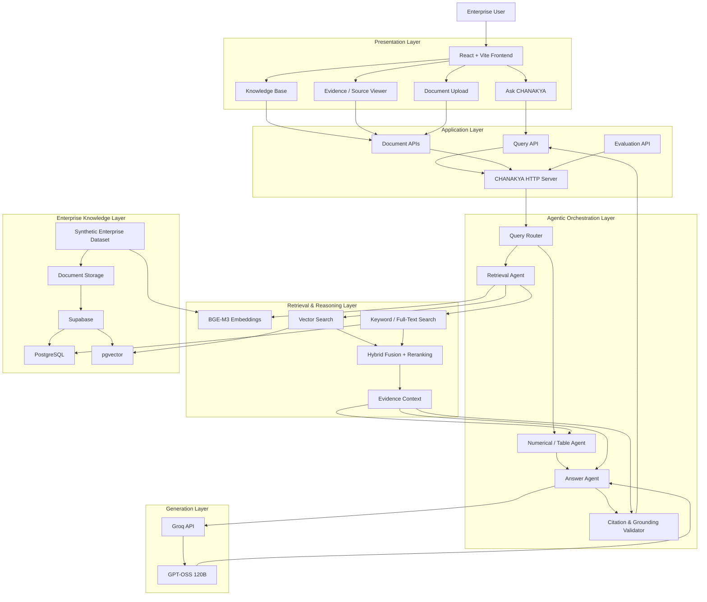
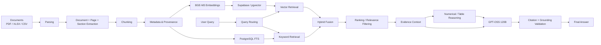

# CHANAKYA — Agentic Enterprise Knowledge & Business Automation Platform

> **Enterprise-grade Agentic RAG platform for grounded business intelligence, document reasoning, numerical analysis, policy interpretation, and evidence-backed decision support.**

CHANAKYA is a reusable, enterprise-agnostic **Agentic Retrieval-Augmented Generation (RAG)** platform designed to turn large collections of departmental business documents into a governed conversational intelligence layer.

The platform currently demonstrates four enterprise domains:

- Finance
- Human Resources
- Manufacturing
- Customer Support

It combines **hybrid retrieval, BGE-M3 embeddings, Supabase/PostgreSQL + pgvector, full-text search, structured table extraction, numerical reasoning, GPT-OSS 120B through Groq, citation validation, and a React/Vite interface**.

> **Important:** The current knowledge base is a **synthetic CHANAKYA Demonstration Dataset** created for academic/product demonstration purposes. It does not represent real company data.

---

## Table of Contents

- [1. Executive Overview](#1-executive-overview)
- [2. Problem Statement](#2-problem-statement)
- [3. Solution](#3-solution)
- [4. Key Objectives](#4-key-objectives)
- [5. Architecture](#5-architecture)
- [6. End-to-End Request Flow](#6-end-to-end-request-flow)
- [7. Agentic Architecture](#7-agentic-architecture)
- [8. RAG Pipeline](#8-rag-pipeline)
- [9. Retrieval Architecture](#9-retrieval-architecture)
- [10. Numerical and Table Reasoning](#10-numerical-and-table-reasoning)
- [11. Grounding and Hallucination Control](#11-grounding-and-hallucination-control)
- [12. Knowledge Base](#12-knowledge-base)
- [13. Evaluation](#13-evaluation)
- [14. Technology Stack](#14-technology-stack)
- [15. Project Structure](#15-project-structure)
- [16. Local Setup](#16-local-setup)
- [17. Environment Configuration](#17-environment-configuration)
- [18. Running the Application](#18-running-the-application)
- [19. API Endpoints](#19-api-endpoints)
- [20. Example Queries](#20-example-queries)
- [21. Git Workflow](#21-git-workflow)
- [22. Production Design Considerations](#22-production-design-considerations)
- [23. Current Limitations](#23-current-limitations)
- [24. Roadmap](#24-roadmap)
- [25. Team](#25-team)
- [26. Academic Context](#26-academic-context)

---

# 1. Executive Overview

Traditional enterprise search systems are good at locating documents, but they often struggle with questions that require:

- combining evidence from multiple documents,
- interpreting policies,
- reading tables,
- calculating business metrics,
- comparing values across periods,
- tracing an answer back to its exact evidence,
- and refusing to answer when the knowledge base does not contain sufficient information.

CHANAKYA addresses this problem through an **agentic enterprise RAG architecture**.

A user can ask a natural-language business question such as:

> **"What was the company's total revenue?"**

CHANAKYA identifies the relevant department/question type, retrieves supporting evidence using hybrid search, validates the evidence, invokes GPT-OSS 120B through Groq, and returns a grounded answer with source-level provenance.

Example:

> The company's total revenue for FY2025 was **Rs 148.2 crore [1]**.

The response is accompanied by:

- source document,
- page,
- section,
- chunk identifier,
- retrieved evidence,
- calculations where applicable,
- routing information,
- grounding status,
- and latency.

---

# 2. Problem Statement

Enterprise information is fragmented across:

- annual reports,
- policies,
- manuals,
- spreadsheets,
- operational reports,
- support records,
- financial documents,
- HR documents,
- and structured tables.

A conventional keyword search system may find a relevant document but does not reliably perform the next steps:

```text
Retrieve
   ↓
Understand
   ↓
Reason
   ↓
Calculate
   ↓
Validate
   ↓
Explain
   ↓
Cite
```

A generic LLM introduces another problem: **hallucination**.

CHANAKYA therefore treats enterprise question answering as a controlled pipeline rather than a simple:

```text
Question → LLM → Answer
```

Instead:

```text
Question
   ↓
Route
   ↓
Retrieve evidence
   ↓
Validate evidence
   ↓
Reason / calculate
   ↓
Generate answer
   ↓
Validate grounding + citations
   ↓
Evidence-backed response
```

---

# 3. Solution

CHANAKYA provides a centralized enterprise intelligence layer over departmental knowledge bases.

The platform supports:

### Factual questions
Direct retrieval of information from enterprise documents.

### Semantic questions
Finding conceptually relevant evidence even when the wording differs.

### Table lookups
Retrieving values from structured tables embedded in PDFs and spreadsheets.

### Numerical reasoning
Performing calculations from retrieved business values.

### Comparisons
Comparing financial, operational, HR, or service metrics.

### Aggregations
Combining multiple pieces of evidence to answer a business-level question.

### Multi-document reasoning
Using evidence from multiple enterprise documents.

### Cross-page reasoning
Combining information located on different pages or sections.

### Policy questions
Answering questions about company policies and procedures.

### Unanswerable questions
Explicitly refusing when the supplied evidence is insufficient.

---

# 4. Key Objectives

CHANAKYA was designed around six core principles:

## 4.1 Grounded Answers

Answers must be supported by retrieved enterprise evidence.

## 4.2 Provenance

Every important answer should be traceable to its:

```text
Document
→ Page
→ Section
→ Chunk
→ Evidence
```

## 4.3 Numerical Reliability

Numerical questions follow a controlled reasoning process:

```text
Retrieve
→ Validate
→ Normalize units
→ Calculate
→ Validate result
→ Explain
→ Cite
```

## 4.4 Structured Data Awareness

Tables are treated as first-class knowledge rather than plain text whenever possible.

## 4.5 Hallucination Resistance

The system is designed to refuse questions when sufficient evidence is unavailable.

## 4.6 Enterprise Reusability

Department-specific behavior is configuration-driven rather than hardcoded around one business use case.

---

# 5. Architecture

The following architecture represents the current CHANAKYA system.



## Architecture Layers

| Layer | Responsibility |
|---|---|
| Presentation | User interaction, questions, documents, evidence |
| Application | HTTP API and request handling |
| Orchestration | Routing and agent coordination |
| Retrieval | Vector + keyword search and ranking |
| Reasoning | Numerical and structured table processing |
| Generation | GPT-OSS 120B through Groq |
| Validation | Grounding and citation checks |
| Knowledge | Supabase/PostgreSQL/pgvector + document storage |

---

# 6. End-to-End Request Flow

For a query such as:

> **"What was the company total revenue?"**

the request follows this lifecycle:

```text
1. User enters question
            ↓
2. React frontend sends POST /query
            ↓
3. Backend receives request
            ↓
4. Query Router identifies:
      • department → Finance
      • question type → Aggregation
            ↓
5. Hybrid Retriever searches:
      • vector similarity
      • keyword / full-text search
            ↓
6. Candidate evidence is fused and ranked
            ↓
7. Evidence sufficiency is checked
            ↓
8. Numerical / table reasoning is invoked where required
            ↓
9. Context is passed to GPT-OSS 120B
            ↓
10. LLM produces grounded answer
            ↓
11. Citation / grounding validator checks response
            ↓
12. API returns:
      • answer
      • sources
      • evidence
      • calculations
      • route
      • grounding status
      • latency
            ↓
13. Frontend renders answer + evidence
```

---

# 7. Agentic Architecture

CHANAKYA uses specialized responsibilities rather than asking a single LLM call to perform the entire workflow.

## 7.1 Query Router

Determines the most appropriate interpretation of the question.

Example routing:

```json
{
  "departments": ["finance"],
  "question_type": "aggregation"
}
```

The router helps narrow retrieval and determines which reasoning path should be used.

---

## 7.2 Retrieval Agent

Responsible for finding the most relevant enterprise evidence.

It combines:

- semantic retrieval,
- keyword/full-text retrieval,
- candidate fusion,
- ranking,
- department filtering,
- relevance thresholds,
- and evidence sufficiency checks.

---

## 7.3 Numerical / Table Agent

Handles questions requiring:

- arithmetic,
- comparisons,
- aggregation,
- percentages,
- table lookups,
- SLA values,
- structured operational data.

The intended reasoning pattern is:

```text
Evidence
   ↓
Extract values
   ↓
Validate units
   ↓
Calculate
   ↓
Validate calculation
   ↓
Return calculation + evidence
```

---

## 7.4 Answer Agent

Generates the final natural-language answer using only the validated evidence/context supplied by the orchestration layer.

The current implementation uses:

```text
GPT-OSS 120B
       ↓
Groq API
```

---

## 7.5 Citation & Grounding Validator

The final response is checked for:

- citation presence,
- numerical grounding,
- evidence support,
- answer completeness,
- and unsupported claims.

The system is designed to avoid producing confident unsupported answers.

---

# 8. RAG Pipeline

CHANAKYA follows a hybrid enterprise RAG pipeline.



---

# 9. Retrieval Architecture

CHANAKYA uses two complementary retrieval signals.

## 9.1 Semantic Retrieval

Documents are embedded using:

```text
BAAI/bge-m3
```

Current embedding dimension:

```text
1024
```

Semantic retrieval helps answer questions where the query and evidence use different wording but share the same meaning.

---

## 9.2 Keyword / Full-Text Retrieval

PostgreSQL full-text search provides a lexical retrieval path.

This is especially valuable for:

- exact policy terminology,
- names,
- identifiers,
- specific metrics,
- document language,
- and exact business phrases.

---

## 9.3 Hybrid Retrieval

The two retrieval paths are combined:

```text
Semantic Search
       +
Keyword Search
       ↓
Candidate Fusion
       ↓
Ranking
       ↓
Relevance Filtering
       ↓
Evidence Context
```

This reduces the weaknesses of relying exclusively on either vector or keyword retrieval.

---

# 10. Numerical and Table Reasoning

Business intelligence frequently depends on structured information.

Examples include:

```text
Revenue
EBITDA
Operating expenses
Production volume
Downtime
SLA response targets
Employee metrics
Support statistics
```

CHANAKYA therefore preserves table information during ingestion and exposes table evidence to the reasoning layer.

A numerical query should conceptually follow:

```text
Question
   ↓
Find relevant table/text evidence
   ↓
Extract values
   ↓
Normalize units
   ↓
Perform calculation
   ↓
Validate result
   ↓
Generate explanation
   ↓
Attach evidence
```

This approach is preferable to allowing the LLM to invent or mentally infer business calculations without explicit evidence.

---

# 11. Grounding and Hallucination Control

Grounding is a core architectural requirement.

CHANAKYA follows the principle:

> **If the knowledge base cannot support the answer, the system should say so.**

The answer pipeline therefore includes:

### Evidence sufficiency

Before generation, the system checks whether retrieved evidence is sufficient.

### Citation validation

Generated answers are checked for expected citation markers.

### Numerical validation

Numbers in answers are checked against:

- retrieved evidence,
- explicit calculations,
- or the original question/context.

### Refusal behavior

For unsupported questions, CHANAKYA is designed to return an evidence-based refusal rather than fabricate an answer.

---

# 12. Knowledge Base

The current CHANAKYA demonstration dataset contains **16 official synthetic enterprise documents**.

### Departments

| Department | Purpose |
|---|---|
| Finance | Financial reporting, budgets, controls |
| HR | Employee policies, compensation, performance |
| Manufacturing | Production, maintenance, quality, operations |
| Customer Support | Service policies, tickets, SLAs, escalation |

### Current dataset inventory

```text
Annual_Report_FY2025.pdf
Budget_and_Forecast_FY2026.xlsx
Budget_and_Forecast_Report_FY2026.pdf
Compensation_and_Performance_Manual.pdf
Customer_Service_Manual.pdf
Employee_Handbook_FY2025.pdf
Financial_Policies_and_Controls.pdf
HR_Policies_Manual.pdf
Machine_Downtime_FY2025.xlsx
Manufacturing_Operations_Manual.pdf
Product_Support_Manual.pdf
Production_and_Maintenance_Report_FY2025.pdf
Quality_and_Safety_Manual.pdf
SLA_and_Escalation_Handbook.pdf
Support_Tickets_FY2025.csv
Weekly_Production_FY2025.xlsx
```

### Current indexed scale

| Metric | Value |
|---|---:|
| Enterprise documents | 16 |
| Indexed chunks | 1,125 |
| Table chunks | 993 |
| Embedding dimension | 1,024 |
| Evaluation questions | 130 |

The dataset is intentionally designed to contain:

- text,
- tables,
- numerical values,
- policies,
- operational metrics,
- financial information,
- support information,
- cross-document relationships,
- and questions where the correct response is to refuse.

---

# 13. Evaluation

CHANAKYA includes a dedicated evaluation suite containing **130 questions**.

The evaluation covers categories including:

- multi-document
- numerical
- policy
- superlative
- table lookup
- unanswerable

## Benchmark Results

Current offline deterministic benchmark:

| Metric | Result |
|---|---:|
| Questions | 130 |
| Answerable | 118 |
| Unanswerable | 12 |
| Retrieval Hit Rate | **1.000** |
| Retrieval MRR | **0.923** |
| Answer Accuracy | **1.000** |
| Grounded Rate | **0.992** |
| Refusal Accuracy | **1.000** |

Category-level benchmark results currently show **1.000** for the evaluated categories listed above.

### Benchmark mode

```text
offline-deterministic
embeddings = BGE-M3
LLM not required for the deterministic benchmark
```

The benchmark is intended to evaluate retrieval, answer correctness, grounding, and refusal behavior independently of live LLM variability.

---

# 14. Technology Stack

## Frontend

| Technology | Purpose |
|---|---|
| React | UI framework |
| Vite | Development/build tooling |
| JavaScript | Frontend implementation |
| Phosphor Icons | Interface icons |
| Motion | UI animation |

## Backend

| Technology | Purpose |
|---|---|
| Python | Backend implementation |
| Custom HTTP server | API layer |
| Pydantic / configuration models | Configuration and validation |
| PyMuPDF / PDF parsing | PDF ingestion |
| OpenPyXL | Excel processing |
| Pandas | Structured data processing |
| Pytest | Testing |

## AI / Retrieval

| Technology | Purpose |
|---|---|
| GPT-OSS 120B | LLM generation |
| Groq | LLM inference |
| BGE-M3 | Embeddings |
| Hybrid retrieval | Semantic + lexical search |
| LlamaIndex | Document/node/index infrastructure |
| PostgreSQL FTS | Keyword retrieval |
| pgvector | Vector retrieval |

## Data / Infrastructure

| Technology | Purpose |
|---|---|
| Supabase | Database + vector storage + document storage |
| PostgreSQL | Metadata and full-text search |
| pgvector | Vector similarity search |
| Docker | Containerization |
| Render configuration | Deployment configuration |

---

# 15. Project Structure

```text
CHANAKYA/
│
├── backend/
│   ├── app/
│   │   ├── config.py
│   │   ├── embeddings.py
│   │   ├── llamaindex_adapter.py
│   │   ├── llamaindex_index.py
│   │   ├── llm.py
│   │   ├── parsers.py
│   │   ├── persistence.py
│   │   ├── pipeline.py
│   │   ├── retrieval.py
│   │   ├── server.py
│   │   ├── store.py
│   │   ├── supabase_retrieval.py
│   │   └── tables.py
│   │
│   └── sql/
│       └── schema.sql
│
├── frontend/
│   ├── src/
│   │   ├── api/
│   │   │   └── chanakya.js
│   │   ├── components/
│   │   ├── App.jsx
│   │   ├── main.jsx
│   │   └── styles.css
│   ├── index.html
│   ├── package.json
│   └── vite.config.js
│
├── data/
│   └── demo/
│
├── eval/
│   ├── questions.json
│   ├── run_eval.py
│   ├── benchmark_hybrid.py
│   └── benchmark_llama.py
│
├── tests/
│   ├── unit/
│   ├── integration/
│   └── ...
│
├── streamlit_app.py
├── docker-compose.yml
├── render.yaml
├── requirements.txt
├── .env.example
├── .gitignore
└── README.md
```

---

# 16. Local Setup

## Prerequisites

Install:

- Python 3.11+ recommended
- Node.js / npm
- Git
- Supabase project
- Groq API key

The current development environment has also been validated with Python 3.14.

---

## Clone the repository

```powershell
git clone https://github.com/Parv-065040/CHANAKYA.git
cd CHANAKYA
```

---

## Create Python environment

```powershell
python -m venv .venv
.\.venv\Scripts\Activate.ps1
```

Install backend dependencies:

```powershell
python -m pip install --upgrade pip
pip install -r .\backend\requirements.txt
```

---

# 17. Environment Configuration

Create:

```text
.env
```

from:

```text
.env.example
```

The application loads environment variables from the project root.

Important configuration categories include:

```env
GROQ_API_KEY=...

SUPABASE_URL=...
SUPABASE_SERVICE_ROLE_KEY=...

SUPABASE_BUCKET=chanakya-docs

STORAGE_BACKEND=supabase
RETRIEVAL_BACKEND=supabase

EMBEDDING_PROVIDER=bge-m3
EMBEDDING_MODEL=BAAI/bge-m3
EMBEDDING_DIMENSION=1024

GROQ_MODEL=openai/gpt-oss-120b

AUTH_MODE=none
CORS_ORIGIN=*

SEED_DEMO_DATA=true
```

### Security

Never commit:

```text
.env
```

Never expose:

- Groq API keys
- Supabase service-role keys
- admin tokens
- database credentials

The repository should contain only `.env.example`.

---

# 18. Running the Application

CHANAKYA can be demonstrated locally using two terminals.

## Terminal 1 — Backend

```powershell
cd C:\Users\Parv\CHANAKYA-DEMO
.\.venv\Scripts\Activate.ps1
$env:PYTHONPATH="C:\Users\Parv\CHANAKYA-DEMO\backend"
python -m app.server
```

Backend:

```text
http://localhost:8000
```

---

## Terminal 2 — Frontend

```powershell
cd C:\Users\Parv\CHANAKYA-DEMO\frontend
npm install
npm run dev
```

Frontend:

```text
http://localhost:5173
```

After the first installation, `npm install` does not need to be repeated unless dependencies change.

---

## Backend health check

```powershell
Invoke-RestMethod http://localhost:8000/health | ConvertTo-Json
```

---

## Example API query

```powershell
$body = @{
    question = "What was the company total revenue?"
    department = $null
} | ConvertTo-Json

Invoke-RestMethod `
    -Uri http://localhost:8000/query `
    -Method Post `
    -ContentType "application/json" `
    -Body $body | ConvertTo-Json -Depth 10
```

Expected behavior:

```text
The company's total revenue for FY2025 was Rs 148.2 crore [1].
```

with supporting evidence from the Annual Report.

---

# 19. API Endpoints

## Health

```http
GET /health
```

Returns application health/configuration information.

---

## Departments

```http
GET /departments
```

Returns available enterprise departments.

---

## Documents

```http
GET /documents
```

Returns indexed documents and metadata.

---

## Document details

```http
GET /documents/{id}
```

Returns document-level information.

---

## Document file

```http
GET /documents/{id}/file
```

Retrieves the stored document.

---

## Source evidence

```http
GET /sources/{chunk_id}
```

Returns source-level evidence for a retrieved chunk.

---

## Evaluation summary

```http
GET /evaluation/summary
```

Returns evaluation information available to the application.

---

## Query

```http
POST /query
```

Example request:

```json
{
  "question": "What was the company total revenue?",
  "department": "finance"
}
```

The response can contain:

```json
{
  "answer": "...",
  "sources": [],
  "calculations": [],
  "evidence": [],
  "route": {},
  "mode": "llm",
  "grounded": true,
  "issues": [],
  "latency_ms": 3924
}
```

---

## Document Upload

```http
POST /documents/upload
```

The frontend supports:

```text
PDF
CSV
XLSX
```

with a frontend upload limit of 25 MB.

---

## Streaming Query

```http
POST /query/stream
```

Provides a streaming response path for compatible frontend workflows.

---

# 20. Example Queries

## Finance

```text
What was the company's total revenue?
```

```text
How much did revenue grow from FY2024 to FY2025?
```

```text
What is the FY2026 budgeted revenue?
```

---

## HR

```text
What is the company's leave policy?
```

```text
What are the performance review requirements?
```

---

## Manufacturing

```text
Which production metrics are reported?
```

```text
What were the major machine downtime issues?
```

---

## Customer Support

```text
What is the first-response target for P1 tickets?
```

```text
What is the resolution target for P2 tickets?
```

---

## Multi-document reasoning

```text
Compare FY2025 revenue with the FY2026 budgeted revenue.
```

---

## Unanswerable questions

```text
What was the CEO's personal investment portfolio?
```

The system should not fabricate an answer if the knowledge base does not contain supporting evidence.

---

# 21. Git Workflow

The recommended development workflow is:

```text
main
  │
  └── stable production/demo branch

develop
  │
  ├── feature/parv-...
  ├── feature/awantika-...
  └── feature/...
```

Recommended process:

```text
Create feature branch
        ↓
Implement
        ↓
Run tests
        ↓
Commit
        ↓
Push
        ↓
Open Pull Request
        ↓
Review / CI
        ↓
Merge into develop
        ↓
Delete feature branch
        ↓
Release stable version to main
```

Example:

```powershell
git checkout develop
git pull origin develop

git checkout -b feature/my-change

git add .
git commit -m "feat: implement my change"

git push origin feature/my-change
```

---

# 22. Production Design Considerations

CHANAKYA is designed as a foundation for an enterprise deployment rather than a single-purpose chatbot.

## Multi-department architecture

Departments are represented as configurable knowledge domains.

```text
Enterprise
│
├── Finance
├── HR
├── Manufacturing
└── Customer Support
```

The same architecture can be extended to:

```text
Legal
Sales
Procurement
IT
Operations
Risk
Compliance
Supply Chain
```

without changing the fundamental RAG architecture.

---

## Governance

A production deployment should maintain:

- document versioning,
- user identity,
- role-based access control,
- department-level permissions,
- audit logs,
- source provenance,
- prompt/version tracking,
- model/version tracking,
- evaluation history.

---

## Security

A production deployment should use:

```text
Authentication
       ↓
Authorization
       ↓
Department / Document ACL
       ↓
Retrieval
       ↓
Grounded Generation
```

The local demonstration uses a simplified authentication configuration and should not be treated as a production security configuration.

---

## Observability

A production implementation can track:

- query latency,
- retrieval latency,
- generation latency,
- retrieval scores,
- token usage,
- answer grounding,
- refusal rate,
- user feedback,
- document ingestion failures,
- model errors.

---

# 23. Current Limitations

The current implementation is a strong academic/product demonstration, but several areas remain suitable for further production hardening.

### Authentication

The local demo defaults to:

```text
AUTH_MODE=none
```

A production deployment should use robust authentication and authorization.

### Frontend deployment

The current demo is optimized for local development using Vite.

### LLM dependency

Final answer generation depends on the availability and performance of the configured Groq model.

### Retrieval tuning

Retrieval quality depends on:

- embedding model,
- chunking,
- metadata,
- query formulation,
- search thresholds,
- fusion/ranking configuration.

### Synthetic dataset

The demonstration dataset is synthetic and should not be interpreted as real enterprise information.

### OCR

Scanned-document OCR is an area for further enhancement where required.

### Enterprise ACLs

Fine-grained row/document/department-level access control should be implemented before handling sensitive enterprise information.

---

# 24. Roadmap

## Phase 1 — Completed Foundation

- [x] Enterprise RAG architecture
- [x] Finance knowledge domain
- [x] HR knowledge domain
- [x] Manufacturing knowledge domain
- [x] Customer Support knowledge domain
- [x] PDF ingestion
- [x] XLSX ingestion
- [x] CSV ingestion
- [x] BGE-M3 embeddings
- [x] Supabase integration
- [x] pgvector retrieval
- [x] PostgreSQL full-text retrieval
- [x] Hybrid retrieval
- [x] Numerical/table reasoning
- [x] GPT-OSS 120B integration
- [x] Groq inference
- [x] Citation validation
- [x] Grounding checks
- [x] Evaluation suite
- [x] React/Vite frontend
- [x] Document upload workflow
- [x] Source evidence viewer

## Phase 2 — Production Hardening

- [ ] Supabase Auth integration
- [ ] Fine-grained RLS/ACL enforcement
- [ ] Enterprise identity integration
- [ ] Audit logging
- [ ] Advanced reranking
- [ ] OCR pipeline
- [ ] Document version management
- [ ] Observability dashboards
- [ ] Automated CI/CD
- [ ] Production deployment hardening

## Phase 3 — Enterprise Expansion

- [ ] Additional departments
- [ ] Role-specific agents
- [ ] Workflow automation
- [ ] Scheduled reports
- [ ] Enterprise connectors
- [ ] Decision-support dashboards
- [ ] Human-in-the-loop approvals
- [ ] Feedback-driven retrieval optimization

---

# 25. Team

| Member | ID | Primary Contribution |
|---|---:|---|
| **Parv Jhamb** | 065040 | Backend, retrieval, embeddings, Supabase, agent orchestration, evaluation |
| **Awantika Kholia** | 065060 | Knowledge base, datasets, evaluation questions |
| **Aman Malhi** | 065010 | Frontend and deployment |

---

# 26. Academic Context

**Project:** CHANAKYA — Agentic Enterprise Knowledge & Business Automation Platform

**Course:** Agentic AI for Business Automation

**Faculty:** Professor Ashok Harnal

**Institution:** FORE School of Management, New Delhi

**Project Type:** Production-oriented academic prototype / enterprise AI demonstration

---

# Final Architecture Summary

CHANAKYA can be summarized as:

```text
                 ┌─────────────────────────────┐
                 │        ENTERPRISE USER      │
                 └──────────────┬──────────────┘
                                │
                                ▼
                 ┌─────────────────────────────┐
                 │       REACT / VITE UI       │
                 └──────────────┬──────────────┘
                                │
                                ▼
                 ┌─────────────────────────────┐
                 │       CHANAKYA API          │
                 └──────────────┬──────────────┘
                                │
                                ▼
                 ┌─────────────────────────────┐
                 │      QUERY ORCHESTRATOR     │
                 └──────────────┬──────────────┘
                                │
              ┌─────────────────┼─────────────────┐
              ▼                 ▼                 ▼
       ┌────────────┐   ┌──────────────┐  ┌──────────────┐
       │   ROUTER   │   │  RETRIEVER   │  │ NUMERICAL /  │
       │            │   │              │  │ TABLE AGENT  │
       └────────────┘   └──────┬───────┘  └──────┬───────┘
                               │                 │
                     ┌─────────┴─────────┐       │
                     ▼                   ▼       │
              ┌─────────────┐    ┌────────────┐ │
              │ BGE-M3      │    │ PostgreSQL │ │
              │ Vector      │    │ Full Text  │ │
              └──────┬──────┘    └─────┬──────┘ │
                     │                  │        │
                     └────────┬─────────┘        │
                              ▼                  │
                     ┌────────────────┐         │
                     │ HYBRID FUSION  │◄────────┘
                     └───────┬────────┘
                             ▼
                     ┌────────────────┐
                     │ EVIDENCE       │
                     │ CONTEXT        │
                     └───────┬────────┘
                             ▼
                     ┌────────────────┐
                     │ GPT-OSS 120B   │
                     │ via Groq       │
                     └───────┬────────┘
                             ▼
                     ┌────────────────┐
                     │ GROUNDING +    │
                     │ CITATION       │
                     │ VALIDATOR      │
                     └───────┬────────┘
                             ▼
                     ┌────────────────┐
                     │ ANSWER +       │
                     │ EVIDENCE +     │
                     │ SOURCES        │
                     └────────────────┘
```

## Core Design Principle

> **CHANAKYA does not treat enterprise AI as an LLM problem alone. It treats it as a controlled information pipeline: retrieve the right evidence, reason over it, validate it, and then communicate the result with provenance.**

---

## Repository

**GitHub:** https://github.com/Parv-065040/CHANAKYA

---

**CHANAKYA — From Enterprise Documents to Evidence-Backed Decisions.**
